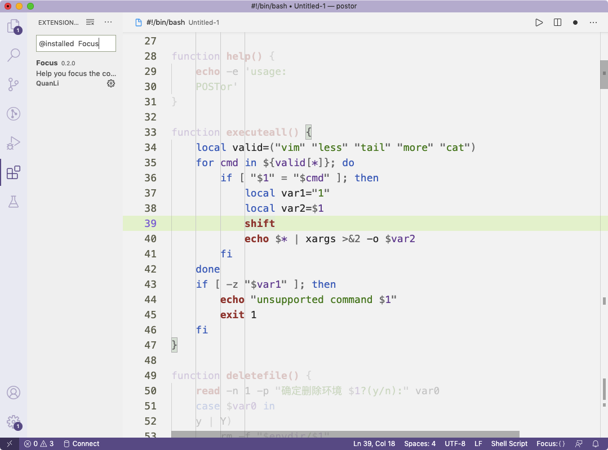

# Focus

Highlight code lines/code blcok what you are focus on.

## Features

* Highlight current line.
* Highlight fixed configuration numbers of lines.
* Highlight lines by indent.
* Highlight code block.

## Usages

* Just install it.
* We provide commands and statusbar button that help you quickly change level.




## Configuration

Set the level by json or UI:

``` json
"focus.highlightRange":"line"   //Highlight current line
"focus.highlightRange":"block"  //Highlight code block which range by *{* and *}*
"focus.highlightRange":"indent" //Highlight lines by indent
"focus.highlightRange":"fixed"  //Highlight line counts by configuration
```

When the level set to *fixed*,configurate how many line to highlight:

``` json
"focus.highlightLines":5
```

Configurate opacity:

``` json
"focus.opacity":0.7 //number between (0,1)
```

## Issues
Submit the [issues](https://github.com/mzzw/focus/issues) if you find any bug or have any suggestion.

## Contribution
Fork the [repo](https://github.com/mzzw/focus) and submit pull requests.